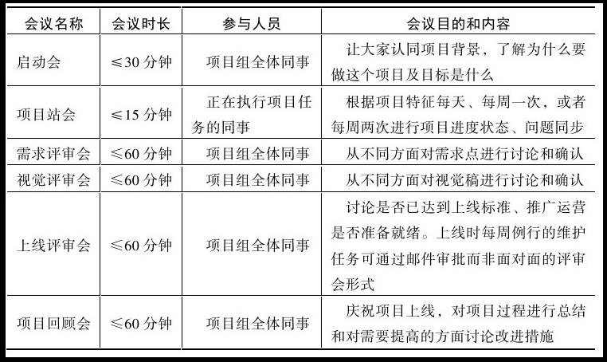
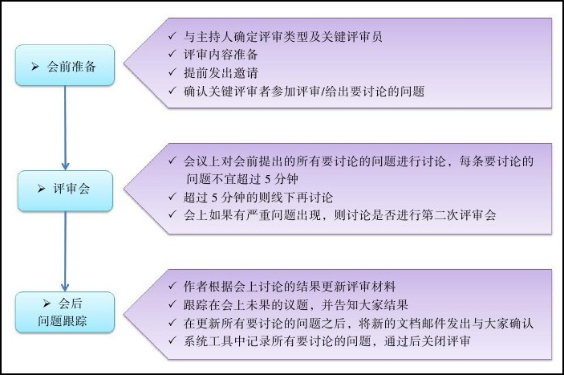

### 给项目经理的建议

**建议一：多想想项目到底需要什么**

接手项目之前，与项目中的重要干系人加强沟通，理解前因后果，多想想项目到底需要什么，对于项目的成功推进至关重要。

每个项目都有它独特的需要，时间、成本、质量到底哪个因素更重要？各个角色目前的痛点在哪儿？哪些是最先需要解决的？哪些是隐藏的积弊？大家对项目管理的认知和接受度怎样？我要通过怎样的途径，全面推进，还是一步步改善？从哪个角度切入？这个蓝图是否清晰？是否与项目负责人沟通到位并达成一致？这些问题能够帮助你理清思路，从项目的真实需求出发，解决问题。

**建议二：不要凡是事必躬亲**

**建议三：不要追在别人屁股后面做监工**

项目经理最该做的，是跟大家一起把事情从头到尾各个环节捋顺了，建立一套对应的流程规则，明确各个角色在过程中的职责，并获得大家的认同，让这个机制自行运转起来。记住应该是规则在约束大家的行为，而不应该是项目经理。当成熟的秩序在团队中形成之后，解放出来的项目经理，就可以更进一步，致力于目标激励、团队建设等更高层面的工作，变“赶”为“引”。

**建议四：言必信，行必果**

**建议五：不一定要强势，但一定要内心足够强大**

（这里说不一定要强势，那么是否意味着强势更好呢？）

### 项目管理的三重境界

做项目、懂业务、懂人

在第二层境界（懂业务）中，项目管理的介入时间点需要前移，参与项目立项前的讨论。理解业务，能够成为业务部门可以依赖的左膀右臂，而不仅仅是被动地接受项目安排，根据设定好的铁三角约束条件交付项目。你需要从业务的角度出发，去引导和参与规划、定义项目，提炼出项目，化被动为主动，清楚地知道为什么立项这个项目，它所带来的业务价值是什么，是通过衡量哪些不同方案和利弊后才做出这样的选择的，外部环境有什么样的制约。项目的最大风险是公司内部风险还是外部市场/政策风险。只有自我认同项目的价值，才能在后续项目执行、讨论过程中遇到问题时能够说服其他项目成员，也能够获得其他人对项目目标的认同。

### 估算那些事

#### 估算的几种常用方式

1. 自下而上估算
   适用的团队：成员间业务独立性强，相互之间的业务熟悉度不高且熟悉成本大，较难进行共同估算；各成员的经验相对丰富，对自己的任务能够进行较准确的评估。
   优势：估算效率高，准确度高
2. 专家判断
   适用团队：有一个熟悉整个项目所有业务和整个项目团队成员的专家或专家组
   优势：估算快速，准确度有保障
3. 扑克估算
   优势：降低主观影响，估算过程中能强化和神话大家对需求和任务的理解。

#### 实际应用中的估算实例

1. 故事点+扑克估算
   团队稳定，敏捷开发经验较丰富，开发语言统一，长期服务于一个产品，成员间对互相的业务也都较为熟悉。
2. 理想人日+专家判断
   团队组建时间短，开发语言不统一，成员经验比较欠缺，对系统熟悉度不高。
3. 理想人时+自下而上
   团队组建时间短，产品模块多，成员对自己模块的业务比较清楚，但对其他模块的业务了解不多

#### 估算需要注意的点

1. 估算仅仅是一个预测
2. 任务分解更细的粒度总是有利于估算的
3. 团队需要练习估算方式并进行回顾
4. 估算需要反复进行，项目进行中出现较大偏差需要重新估算剩余工作，并采取措施

### 周会与周报

#### 周会

**周会的目的：**

1. 面对面地感受项目当前的整体状态、重要问题、接下去的目标以及所需的调整。
2. 借此来对项目当前的重要问题有一致的认识，进行小幅度的讨论，并形成下一步工作事项。

**开好周会的要点：**

1. 控制规模和时间
2. 不要轮流汇报
3. 明确讨论问题
4. 固定时间地点
5. 如果有站会了，可以省略周会或降低频率

**不适合周会讨论的内容**

1. 急事，要第一时间拍板
2. 非跨团队的问题
3. 执行细节的问题
4. 大方向决策问题

**适合周会讨论的内容**

1. 跨团队的
2. 涉及整体计划性或协同配合的问题
3. 中期改进问题

#### 周报

##### 一、三要

1. 周报要包括整体进展、整体风险、各子线状态、各子线风险。周报应该让大家清楚重要的进展、目标达成情况、风险状态以及应对措施。总之，看完周报，大家应该对项目现状有清晰的整体认知。
2. 整体进展、整体风险、各子线状态、各子线风险。周报应该让大家清楚重要的进展、目标达成情况、风险状态以及应对措施。总之，看完周报，大家应该对项目现状有清晰的整体认知。
3. 要有提炼自数据的关键信息。需要提供相应的信息而不仅仅是数据，信息和结论来源于数据分析，通过数据分析出相应的有价值的信息是每位项目经理、其他管理人员的核心竞争力之一，数据可能是客观存在、无序而杂乱的，而信息是用来衡量现状和指引我们下一步行动的基础。产品数据一定是敏感数据，并不适合实时向所有人公开，因此，并不需要在周报里列清所有数据，要把控好周报的分发范围。

##### 二、三不要

1. 篇幅不要过长，控制写周报的时间和复杂度，适当图形化。
2. 不要有令人惊讶的内容。状态报告仅仅是工作的状态总结呈现，更多的沟通工作和问题处理应该在汇报之外处理。发现问题，要及时分析和解决，而不是等待报告项目状态的时间来临再寻求帮助。
3. 不要直接拷贝粘贴你下属的报告。想想我们存在的价值就知道这其中的含义了。

**给领导的周报**

|                           内容                           |                            说明                            |
| :------------------------------------------------------: | :--------------------------------------------------------: |
| 上周已达成的结果（跟计划相比如果有差距，则列出如何改进） |                       量化的结果指标                       |
|     未来一段时间的规划图（根据团队规模1到3个月不等）     | 通过图形化的方式言简意赅地列出任务的时间点和期望达成的结果 |
|             达成如上规划图的风险/需要的协助              |            资源风险、合作方风险及建议的应对方案            |

#### 会议

- 项目主要会议
  

- 如何制定会议议程表

  1. 明确的会议目的
  2. 会议想要实现的目标或产生的结果
  3. 参会的人员
  4. 开会的时间地点
  5. 会议持续时间
  6. 主持人
  7. 参会者分别承担的任务
  8. 会议的议题
  9. 筹备阶段所需的背景资料

- 会议收尾

  1. 重申所讨论的关键问题
  2. 重申所做出的决策
  3. 重申下一步计划如何实施
  4. 重申每个任务由谁负责

- 评审会流程样例

  

### 高效回顾，引导团队从优秀到卓越

### 访谈

（1）部门的愿景是什么（或者项目的目标是是什么）？
（2）目前项目或部门中的主要风险/问题有哪些？
（3）目前的工作方式/流程是怎么样的？团队成员的分工是怎么样的？
（4）目前质量衡量指标有哪些？
（5）影响项目成功的关键因素是什么？如何界定项目的成功？
（6）对项目管理的期望是什么？